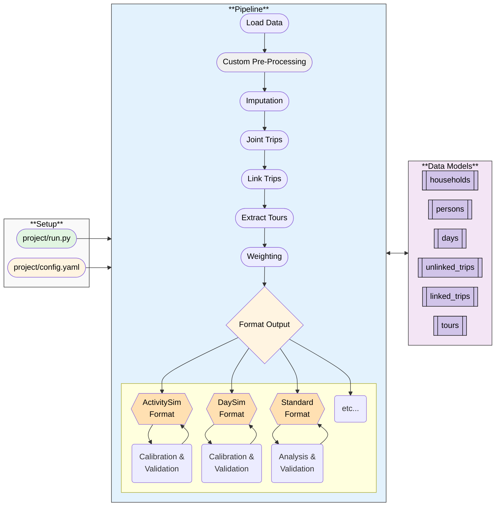

# Travel Diary Survey Tools
Tools for processing and validating travel diary survey data into standardized formats for transportation modeling.


## Table of Contents

- [Objectives](#objectives)
- [Overview](#overview)
- [Architecture](#architecture)
  - [Conceptual Diagram](#conceptual-diagram)
  - [Pipeline Steps](#pipeline-steps)
- [Usage](#usage)
  - [Quick Start](#quick-start)
    - [1. Installing UV & Virtual Environment Setup](#1-installing-uv--virtual-environment-setup)
    - [2. Configuration](#2-configuration)
    - [3. Pipeline Runner](#3-pipeline-runner)
  - [Data Models and Validation](#data-models-and-validation)
    - [`step` Decorator and Validation](#step-decorator-and-validation)
  - [Documentation](#documentation)
- [Work Plan](#work-plan)
- [Development](#development)
  - [Project Structure](#project-structure)
  - [Running Tests](#running-tests)
  - [Code Quality](#code-quality)
  - [Pre-commit Hooks](#pre-commit-hooks)
- [Contributing](#contributing)

---

## Objectives
* **Standardized**
  * Standardized data models for travel diary surveys
  * Standardized data processing algorithms
  * Comprehensive validation framework that checks both schema and content
* **Replicable**
  * Reproducible data processing pipelines
  * Transparent, modular, and well-documented algorithms
* **Extensible**
  * Modular processing steps, enabling new steps to be added easily
  * Customizable pipeline configurations for module logic and parameters
  * Adaptable output formats (e.g., ActivitySim, DaySim, CT-RAMP, General Analysis, etc.)

## Overview

* **Validate** input/output between each step to ensure data integrity
* **Format** at end only, retain consistent internal data structure throughout pipeline
* **Custom pre-processing** step for data cleaning, rather than muddling the source code with one-off fixes

## Architecture

The usage pattern for the pipeline is a bit different than the typical numbered scripts you might see elsewhere. *There is no monolithic integrated script*. Instead there is a standardized data processing pipeline that is configurable via YAML files and executed via a runner script.

There are three main components:
* **Setup**
  * This contains the point of entry defined in `project/run.py` and
  * Pipeline configuration defined in `project/config.yaml`
* **Pipeline Execution**
  * The central `Pipeline` class defined in `src/processing/pipeline.py`
  * A set of modular processing steps defined in `src/processing/steps/`
* **Data Models and Validation**
  * Canonical data models and validation logic defined in `src/data_canon/`
  * This can be used standalone, but also is integrated into the pipeline steps for automatic validation
  * The data models define the expected schema and content for each data table (households, persons, days, trips, tours, vehicles, etc.) Each field is tagged with a set of constraints, and the step it pertains.

### Conceptual Diagram


### Pipeline Steps

The data processing pipeline consists of modular steps that transform raw survey data into model-ready formats. Each step has well-defined inputs, outputs, and algorithms:

#### Core Processing Steps

1. **[Load Data](src/processing/read_write/README.md)** - Loads canonical survey tables from CSV, Parquet, or geospatial files into memory
2. **[Cleaning](src/processing/cleaning/README.md)** - Project-specific data cleaning operations (e.g., fixing time/distance errors, adding missing records)
3. **Imputation** *(placeholder)* - Imputes missing values for key variables (e.g., mode, purpose, locations)
4. **[Link Trips](src/processing/link_trips/README.md)** - Aggregates individual trip segments into complete journey records by detecting mode changes and transfers
5. **[Detect Joint Trips](src/processing/joint_trips/README.md)** - Identifies shared household trips using spatial-temporal similarity matching
6. **[Extract Tours](src/processing/tours/README.md)** - Builds hierarchical tour structures (home-based tours and work-based subtours) from linked trips
7. **Weighting** *(placeholder)* - Calculates expansion weights to match survey sample to population targets
8. **[Format Output](src/processing/formatting/daysim/README.md)** - Transforms canonical data to model-specific formats (DaySim, ActivitySim, etc.)
    - **[DaySim Format](src/processing/formatting/daysim/README.md)** - Formats data for DaySim model input
    - **[CT-RAMP Format](src/processing/formatting/ctramp/README.md)** - Formats data for CT-RAMP model input
9. **[Final Check](src/processing/final_check/README.md)** - Validates complete dataset against canonical schemas before export
10. **[Write Data](src/processing/read_write/README.md)** - Writes processed tables to output files with optional validation

Each step README provides detailed documentation on:
- Input/output data requirements
- Core algorithm and processing logic
- Configuration parameters
- Implementation notes

---

# Usage

## Quick Start

### 1. Installing UV & Virtual Environment Setup

1. Open PowerShell and run (or follow another method from https://docs.astral.sh/uv/getting-started/installation/):
```powershell
powershell -c "irm https://astral.sh/uv/install.ps1 | iex"
```
2. Verify the installation. You may need to restart your terminal:
```powershell
uv --version
```
3. Navigate to the project directory:
```powershell
cd C:\GitHub\travel-diary-survey-tools
```
4. Create a virtual environment and install dependencies:
```powershell
uv sync
```
5. Activate the virtual environment:
```powershell
.venv\Scripts\Activate.ps1
```
In VSCode you can select the interpreter manually with the GUI.

### 2. Configuration

The pipeline is configured using YAML files that specify input data, steps, and parameters:

```yaml
# config.yaml

# Define directory shorthands
survey_dir: "M:/some/path/to/survey/data"
output_dir: "M:/some/path/to/output/data"
TM1_shapefile_dir: "X:/travel-model-one/utilities/geographies"
TM2_shapefile_dir: "X:/tm2py-utils/tm2py_utils/inputs/maz_taz/shapefiles"

# Pipeline configuration
steps:
  - name: load_data
    validate: false # This will override @step(validate=True/False) in the function definition
    params:
      input_paths:
        households: "{{ survey_dir }}/hh.csv"
        persons: "{{ survey_dir }}/person.csv"
        days: "{{ survey_dir }}/day.csv"
        unlinked_trips: "{{ survey_dir }}/trip.csv"

  - name: custom_cleaning
    validate: false

  # - name: imputation
  #   validate: true

  - name: link_trips
    validate: true
    params:
      change_mode_code: 11  # Purpose code for 'change_mode'
      transit_mode_codes: [12, 13, 14]
      max_dwell_time: 180  # in minutes
      dwell_buffer_distance: 100  # in meters

  - name: extract_tours
    validate: true

  - name: custom_add_zone_ids
    validate: true
    params:
      zone_geographies:
        - zone_name: "taz"  # Primary TAZ for DaySim
          shapefile: "{{ TM2_shapefile_dir }}/tazs_TM2_2_5.shp"
          zone_id_field: "TAZ_NODE"
        - zone_name: "maz"  # Primary MAZ for DaySim
          shapefile: "{{ TM2_shapefile_dir }}/mazs_TM2_2_5.shp"
          zone_id_field: "MAZ_NODE"
        # Add additional zone geographies as needed:
        - zone_name: "TAZ1454"
          shapefile: "{{ TM1_shapefile_dir }}/bayarea_rtaz1454_rev1_WGS84.shp"
          zone_id_field: "TAZ1454"

  - name: weighting
    validate: true

  - name: final_check
    validate: true

  - name: format_output
    validate: true
    params:
      format: "daysim"
      outputs:
        households_daysim: "{{ survey_dir }}/hh_daysim.csv"
        persons_daysim: "{{ survey_dir }}/person_daysim.csv"
        days_daysim: "{{ survey_dir }}/day_daysim.csv"
        linked_trips_daysim: "{{ survey_dir }}/linked_trip_daysim.csv"
        tours_daysim: "{{ survey_dir }}/tour_daysim.csv"

  - name: format_output
    validate: false
    params:
      format: "standard"
      outputs:
        households: "{{ output_dir }}/households.csv"
        persons: "{{ output_dir }}/persons.csv"
        days: "{{ output_dir }}/days.csv"
        unlinked_trips: "{{ output_dir }}/unlinked_trips.csv"
        linked_trips: "{{ output_dir }}/linked_trips.csv"
        tours: "{{ output_dir }}/tours.csv"

```

### 3. Pipeline Runner

You need a runner script to execute the pipeline, typically named `run.py`. This also allows for CLI execution for automation.

You can also inject custom pre-processing steps here. The goal is to **keep the core pipeline code generalized for maintainability, but allow for custom logic to be injected as needed**.

```python
# project/run.py
from pathlib import Path
import polars as pl

from pipeline.decoration import step
from pipeline.pipeline import Pipeline

# Optional: project-specific custom step functions
# Could put this in a separate py file and import to keep this runner concise and consistent
# Must tag with @step() decorator to be recognized by the pipeline
@step()
def custom_cleaning(
    persons: pl.DataFrame,
    days: pl.DataFrame,
    unlinked_trips: pl.DataFrame
    ) -> dict[str, pl.DataFrame]:
    """Custom cleaning steps go here, not in the main pipeline."""

    # Do some stuff...
    unlinked_trips = unlinked_trips.rename({"arrive_second": "arrive_seconds"})
    days = days.with_columns(
        travel_dow = pl.col("dow_that_starts_from_0") + 1
    )

    return {"unlinked_trips": unlinked_trips, "days": days}

custom_steps = {
    "custom_cleaning": custom_cleaning,
}

# Path to the YAML config file you provided
CONFIG_PATH = Path(__file__).parent / "config_daysim.yaml"

# ---------------------------------------------------------------------
if __name__ == "__main__":
    import argparse

    # Parse command-line arguments
    parser = argparse.ArgumentParser(description="Pipeline Runner")
    parser.add_argument(
        "--clear-cache",
        action="store_true",
        help="Clear the pipeline cache before running",
    )
    args = parser.parse_args()

    logger.info("Starting FooBar Processing Pipeline")

    # Clear cache if requested
    cache_dir = Path(".cache")
    if args.clear_cache and cache_dir.exists():
        logger.info("Clearing pipeline cache")
        import shutil
        shutil.rmtree(cache_dir)

    pipeline = Pipeline(config_path=CONFIG_PATH, custom_steps=custom_steps)
    result = pipeline.run()

    logger.info("Pipeline finished successfully.")

```

To run, press the green arrow in your IDE, or run from command line:

```bash
uv run python project/run.py

# Clear cache before running
uv run python project/run.py --clear-cache
```

**Logging**: The pipeline automatically creates a log file in the output directory (e.g., `output/pipeline.log`) that contains all console output plus additional debugging information.

---

## Data Models and Validation

There are four main components to the data models and validation framework. Three you will typically interact with directly, and one that is more internal:
* **Data Models** - Define the expected schema for each data table, and the fields associated with each processing step
* **Enumerations and Codebook** - Define reusable enumerations and labeled values (e.g., mode types, purpose codes, etc.)
* **Validators** - Implement the validation logic for rows, columns, and relational integrity
* **CanonicalData class** - Manages the collection of data tables and runs validations. This is internal infrastructure used by the pipeline, but can also be used standalone to validate data outside the pipeline if desired (e.g., you want to validate some raw survey data before doing anything else with it).

The validation framework provides four layers of validation:

* **Row Validation** - Pydantic validation of data types and value ranges for each record (e.g., greater than 0, no nulls, etc.)
* **Column Constraints** - Enforce constraints across entire columns (e.g., uniqueness of IDs, etc.)
* **Relational Integrity** - Cross-table consistency checks (e.g., does each household have persons, etc.)
* **Custom Validators** - User-defined validation logic (e.g., trip chaining logic, )
* **Step Aware Validation** - Different fields can be explicitly tagged as required for specific processing steps


Validation is run automatically at the start of each processing step via the `@step()` decorator. Fields must be tagged as required for the specific step to be enforced, but if a field is present it will always be validated for type and constraints regardless of whether it's required for that step. This permissive enforces data integrity throughout the pipeline, ensuring dat does not degrade.


### `step` Decorator and Validation
Data pipeline steps must be tagged with the `@step()` decorator. This lets the pipeline know it's a processing step and handles passing the params and validation automatically. It will parse the arguments based on the function signature, sending the canonical tables to the appropriate parameters, and any other config params defined in the YAML (e.g., households to households and other_arg1 to other_arg1, etc.).

Notes:
* The names of the parameters matter, they must match either canonical data model names or config param names in the YAML.
* By default, the `@step()` decorator enables validation. You can override this in the config YAML per step with `validate: true/false`.*

```python
from pipeline.decoration import step

@step(validate=True)
def new_processing_step(
    households: pl.DataFrame, # Must be a canonical data model named "households"
    persons: pl.DataFrame,    # Must be a canonical data model named "persons"
    other_arg1: int,          # Must be defined in the config.yaml under params for the step
    other_arg2: str           # Must be defined in the config.yaml under params for the step
) -> dict[str, pl.DataFrame]:
    """A new processing step example."""
    # Do some processing...
    persons = persons.filter(pl.col("age") >= 18)
    return {"persons": persons}
```


## Additional Documentation
For more details, see:
* [Validation Framework Documentation](docs/VALIDATION_README.md) - Which goes into more detail on the validation framework architecture and usage.
* [Column Requirements Documentation](docs/COLUMN_REQUIREMENTS.md) - Contains auto-generated tables and enums for easy reference on which fields are required for each processing step. Essentially summarizes the data models in a table.


---

## Work Plan

- **Minimal Viable Product (MVP)**
  - [x] Core data models and validation
    - [x] Define canonical data models for households, persons, days, trips, tours, vehicles
    - [x] Implement validation framework with row, column, relational, and custom validators
  - [x] Core pipeline orchestration
  - [x] Basic pipeline to match existing legacy pipeline functionality. See [Daysim Comparison Analysis - Key Findings](projects/bats_2023/compare/comparison_findings.qmd) for a detailed comparison of the new pipeline versus the legacy pipeline, including methodology, key differences, and validation results.
- **Align and iterate** data models with upstream/downstream needs
  - [ ] Engage with downstream stakeholders to identify needs and requirements
  - [ ] Engage with upstream data providers to set expectations and requirements
- **Extend Functionality**
  - [x] Implement trip linking algorithm as processing step
  - [x] Implement joint trips detection algorithm processing step
  - [x] Implement tour extraction processing step
    - [x] enhanced tour extraction to handle joint tours/trips
  - [ ] Implement imputation processing step
  - [ ] Implement weighting processing step
  - [ ] Implement bespoke output formats
    - [x] Implement Daysim output format
    - [ ] Implement ActivitySim output format
    - [ ] Implement CT-RAMP format

**The primary goal is to establish a solid foundation with the core data models, validation, and basic pipeline functionality, then build upon that iteratively based on stakeholder feedback and evolving needs.**

Note that some of these items may be iterative and require previous steps to be revisited as new requirements emerge. For example, CTRAMP and ActivitySim will require more advanced and granular tour extraction logic than the current basic implementation.

The plan to handle this is to create tours with maximum granularity and flexibility in the initial extraction step, then allow for downstream formatting steps to aggregate or adjust tours as needed for specific model requirements. This way, the core tour data remains rich and adaptable.

---

## Development

### Project Structure

```
travel-diary-survey-tools/
├── scripts/                        # One-off helper scripts
├── projects/                       # Example configs and runners.
├── src/
│   ├── data_canon/
|   |   ├── validation <----------- # Column, row, relational, and custom validators here!
│   │   ├── codebook/ <------------ # Categorical Enums defined here!
|   |   ├── models/ <-------------- # Data models defined here!
│   │   └── core/
│   └── pipeline/ <---------------- # Pipeline orchestration code.
│   |   ├── pipeline.py
│   |   ├── decoration.py
│   └── processing/ <-------------- # Processing code go here!
│       ├── read_write/
│       ├── imputation/             # Not yet implemented
│       ├── joint_trips/
│       ├── link_trips/
│       ├── extract_tours/
│       ├── weighting/              # Not yet implemented
│       └── formatting/ <---------- # Define bespoke output formatting here!
├── tests/                          # Test suite
└── docs/                           # Documentation
```


### Running Tests
Tests can be run using `pytest` via VSCode extension or command line:

```bash
# Run all tests
uv run pytest

# Run with coverage
uv run pytest --cov=src --cov-report=html

# Run specific test file
uv run pytest tests/test_validation.py -v
```

### Code Quality

The project uses `ruff` for linting and formatting:

```bash
# Run linter
ruff check src/some_module/

# Auto-fix issues
ruff check --fix src/some_module/

# Format code
ruff format src/some_module/
```

### Pre-commit Hooks

Install pre-commit hooks to ensure code quality before committing. It basically runs the linters and formatters automatically when you try to commit code. You can also run it manually with:

```bash
pre-commit run
```

## Contributing

1. Create a new branch for your feature
2. Make your changes with appropriate tests
3. Ensure all tests pass and code is formatted
4. Submit a pull request

## License

[Add license information here] :P
