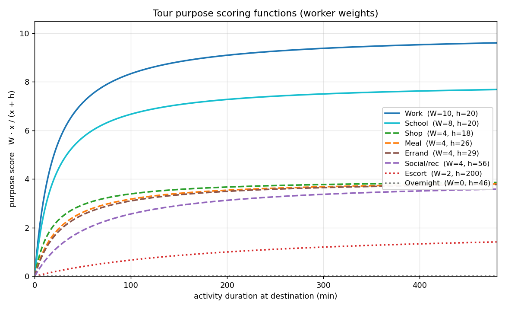
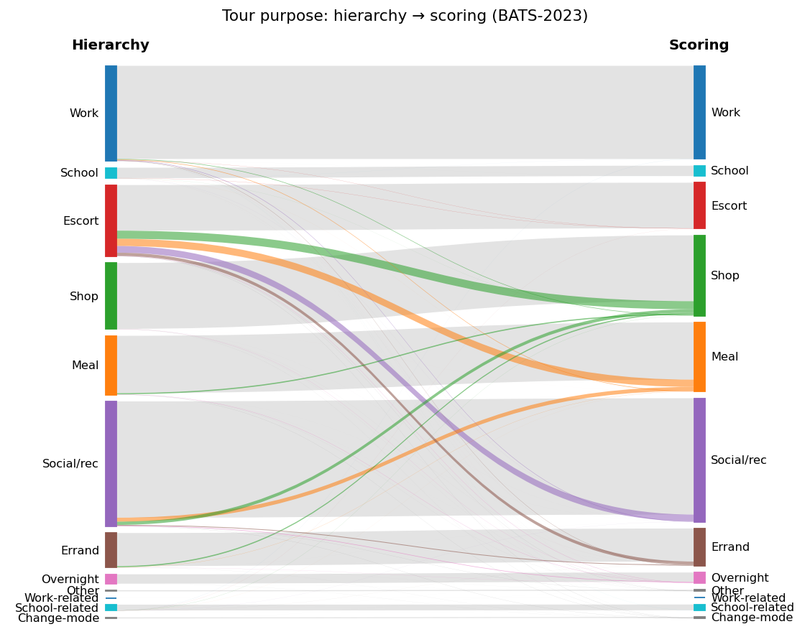

::: processing.tours.extraction
    options:
      show_root_heading: true
      show_root_toc_entry: false
      members:
        - extract_tours
      filters:
        - "!^logger$"
        - "!^_"

## Determining tour purpose

A tour visits several places; the extractor picks which one *is* the tour
(home → work → lunch → work → home is a work tour). The purpose is chosen from
the non-final destinations, using their purpose and **activity duration** (time
spent before the next trip). Two methods, set by `tour_purpose_method`.

### Hierarchy (`"hierarchy"`)

Each purpose has a fixed priority rank by person category
(`purpose_priority_by_personcat`); the highest-ranked purpose present wins,
duration only breaks ties within a rank. Predictable, but priority is absolute:
a 2-minute work stop outranks a 4-hour shop.

### Scoring (`"score"`, default)

Duration and purpose trade off, so a long activity can outweigh a brief
higher-priority one. Each candidate scores

    score = W · x / (x + h)

`x` = activity duration (min); `W` = ceiling weight; `h` = half-saturation
duration (score = `W/2` at `x = h`, rising toward `W`). Highest score wins.

- **`W`** (`purpose_score_weights`) = the priority order, with escort demoted to
  the bottom. Only ratios matter, and it stays per person category (a work+school
  day resolves to work for a worker, school for a student).
- **`h`** (`purpose_score_halfmax`) = the median dwell for discretionary
  purposes; a fixed threshold for the rest.

| purpose | `W` | `h` (min) | `h` source |
|---|---|---|---|
| Work, School | 10 / 8 | 20 | fixed low threshold — a real visit is sticky; below it is a drive-by. *Not* the ~5 h median, which would demote short real visits. |
| Shop, Meal, Social, Errand | 4 | 18, 26, 56, 29 | BATS-2023 median dwell — duration picks the primary discretionary activity |
| Escort | 2 | 200 | fixed high — suppressed; only wins a pure drop-off-then-home tour |
| Overnight | 0 | — | never wins |

`h` must differ by purpose: with a shared `h`, scores become constant multiples
and duration cancels, collapsing back to the hierarchy.

The scoring-function figure is regenerated from the config defaults by
`scripts/plot_purpose_scoring.py`.

### Effect vs the hierarchy

Switching BATS-2023 from hierarchy to scoring leaves work and school almost
unchanged (the sticky mandatory `h`), collapses escort (drop-off-then-activity
tours move to the real activity), and re-sorts discretionary tours by duration.

This figure is a BATS-2023 snapshot, regenerated from the committed counts in
`docs/assets/data/` by `scripts/plot_purpose_reclassification.py`.
