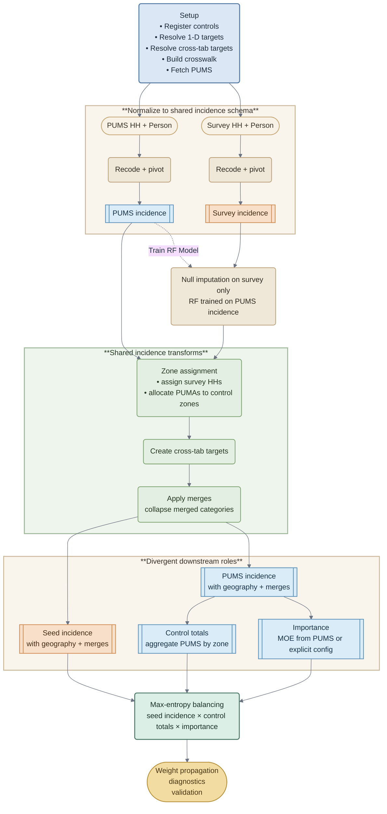

# Compute Weights

This path computes new expansion weights from PUMS controls and survey seed data.

It is the full weighting workflow, including:

- data preparation and PUMS fetching
- control recoding and shared incidence construction
- survey null imputation
- zone assignment and control merges
- control aggregation and importance resolution
- max-entropy balancing
- weight propagation, diagnostics, and validation

Both **PUMS** (Census microdata) and **Survey** (travel-diary seed) are conformed to the same **incidence schema**: one row per household, with shared 1-D controls and **cross-tab targets** expanded into a common set of incidence columns. That shared representation is what allows the same geography and merge logic to operate on both datasets.

The important split is not that PUMS and survey run as fully parallel pipelines. It is that they are both transformed into the same incidence format. From there, **PUMS incidence** is used to produce **control totals** and MOE-based importance, while the **survey incidence** becomes the **seed** to be reweighted. Null imputation is applied only to the survey side; PUMS is used as the training source for that step.

::: processing.weighting.compute_weights
    options:
      show_root_heading: true
      members:
        - compute_weights

## WeightingPipeline

`WeightingPipeline` is the orchestration class that `compute_weights` constructs and drives. It holds all intermediate state (crosswalk, incidence, control totals, weights, diagnostics) and exposes each stage as an explicit method.

::: processing.weighting.weighting_pipeline
    options:
      show_root_heading: true
      members:
        - WeightingPipeline

## Related Topics

- [Data Preparation](data_preparation.md)
- [Crosswalk](crosswalk.md)
- [Balancing](balancing.md)
- [Controls](controls.md)
- [Validation](validation.md)
- [Diagnostics](diagnostics.md)
