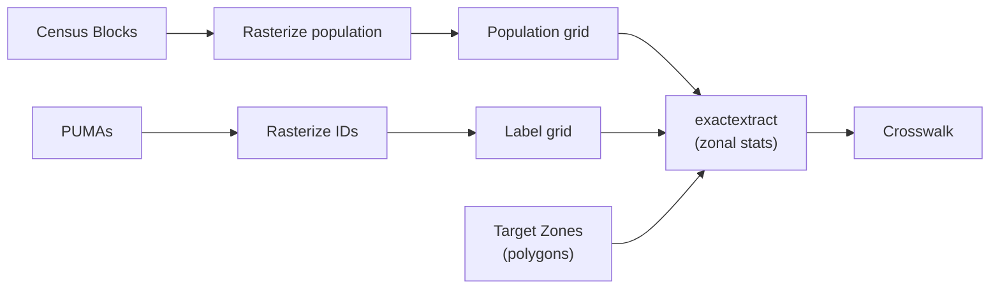

# Population-Weighted Geography Crosswalk

## Overview

The weighting pipeline uses a population-weighted crosswalk to map **PUMAs** onto user-defined **target zones**. Because the source and target boundaries rarely align, Census blocks are rasterized into a population grid, PUMAs are rasterized into a label grid, and [`exactextract`](https://github.com/isciences/exactextract) performs zonal cross-tabulation against the target polygons.

The implementation lives in `src/processing/weighting/data_prep/crosswalk.py`.



## Calculation Details

### 1. Rasterization

Two arrays are burned onto a common grid (CRS: EPSG:5070, NAD83 CONUS Albers) at a configurable cell size (default 250 m):

| Array | Dtype | Cell value |
|-------|-------|------------|
| **Weight** (`pop`) | float32 | Block population distributed evenly across the cells each block covers: `cell_pop = block_pop / n_cells` |
| **Source label** | int32 | Integer ID of the source zone covering that cell (0 = no data) |

### 2. Zonal Cross-Tabulation (`exactextract`)

Both rasters are written to temporary GeoTIFFs and passed to [`exactextract`](https://github.com/isciences/exactextract) together with the target-zone polygon layer:

```python
exact_extract(
    [weight_path, source_path],
    target_gdf,
    ["values", "coverage"],
    include_cols=["target_id"],
)
```

For each target zone polygon `z`, exactextract returns per-cell arrays of:

- `v_i_weight`: weight value of cell `i`
- `v_i_source`: integer source-zone label of cell `i`
- `c_i`: coverage fraction of cell `i` by polygon `z`

In plain terms, each cell contributes `weight value * polygon coverage fraction`.

### 3. Population by Source × Target Zone

Within each target zone `z`, cells are grouped by source label `s`, and the coverage-weighted population is summed across all matching cells.

### 4. Allocation Weights

Each source zone's population is then normalized across target zones:

- `allocation_weight(s, z) = Pop(s, z) / total source population`

By construction, the allocation weights sum to `1.0` across target zones for each source zone.

## Worked Example


Assume a 4 x 4 grid of equal-sized cells, with each populated cell contributing `10` people.

- **Source A** occupies the left 8 cells, so its total population is `80`.
- **Source B** occupies the right 8 cells, so its total population is `80`.
- **Zone L** captures about `75%` of Source A.
- **Zone M** captures the remaining `25%` of Source A and `25%` of Source B.
- **Zone R** captures the remaining `75%` of Source B.

That gives the following source-by-target populations:

| Source | Target zone | Population contribution |
|---|---|---:|
| A | L | 60 |
| A | M | 20 |
| B | M | 20 |
| B | R | 60 |

Now normalize within each source zone:

For **Source A**:

- `allocation_weight(A, L) = 60 / 80 = 0.75`
- `allocation_weight(A, M) = 20 / 80 = 0.25`

For **Source B**:

- `allocation_weight(B, M) = 20 / 80 = 0.25`
- `allocation_weight(B, R) = 60 / 80 = 0.75`

So the final crosswalk rows would look like this:

| source_id | target_id | allocation_weight |
|---|---|---:|
| A | L | 0.75 |
| A | M | 0.25 |
| B | M | 0.25 |
| B | R | 0.75 |

This is the key idea: each source geography is split across target zones in proportion to the coverage-weighted population captured in each target polygon.

## API

The PUMA-specific wrapper classes live on the [Data Preparation](data_preparation.md) page:

- `PumaCrosswalk`
- `TargetZoneConfig`
- `GeographyConfig`

### Generic crosswalk function

`build_crosswalk` is the underlying generic implementation — it works with any source/target/weight polygon combination and is not specific to PUMAs or weighting.

::: utils.crosswalk
    options:
      show_root_heading: true
      members:
        - build_crosswalk
