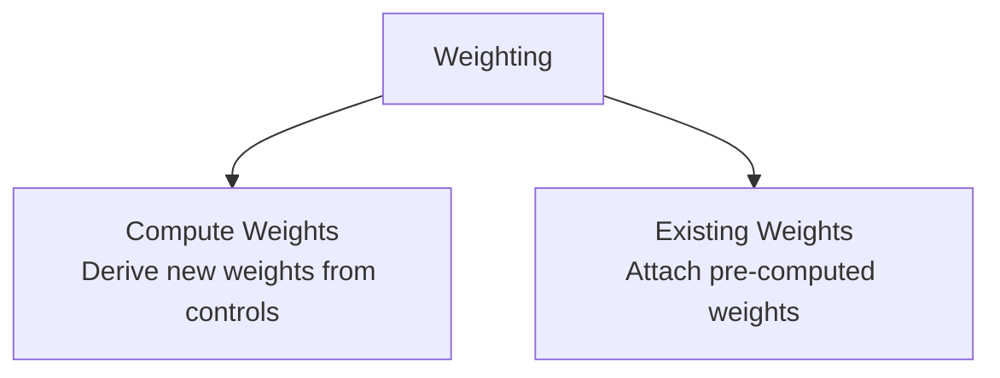

# Weighting

## Overview

Weighting has two mutually exclusive options:

- [**Compute Weights**](compute_weights.md) computes new weights from PUMS controls and survey seed data.
- [**Existing Weights**](existing_weights.md) attaches weights that were already computed elsewhere.

Only the **compute weights** option needs the full weighting pipeline machinery such as PUMS fetching, crosswalk construction, incidence preparation, control aggregation, balancing, diagnostics, and control validation. The **existing weights** option is much lighter: it joins external weight files onto canonical tables and can optionally derive missing downstream weights through the survey hierarchy.

## Choose an Option

| Option | Use when | Key inputs | Main output |
|---|---|---|---|
| [**Compute Weights**](compute_weights.md) | You need to create expansion weights from controls | PUMS, geography, control definitions, survey tables | New household weights propagated to all tables |
| [**Existing Weights**](existing_weights.md) | You already have weight files from another system or prior run | Weight CSVs keyed to canonical IDs | Existing weights attached and optionally propagated |

::: processing.weighting
    options:
      show_root_heading: true
      show_docstring_description: true
      members: false
