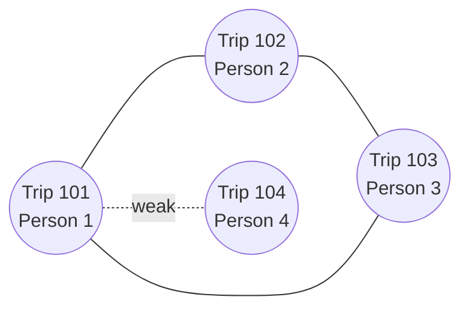

[← Back to Main README](../../../README.md)

# Joint Trips Pipeline Steps

This module detects joint trips where multiple household members travel together by identifying trips with similar spatial and temporal characteristics.

## Pipeline Steps

### `detect_joint_trips`

Identifies shared household trips using similarity matching based on origin-destination-time patterns.

**Inputs:**
- `linked_trips`: Journey records with coordinates and timing (pl.DataFrame)
  - Required columns: linked_trip_id, hh_id, person_id, o/d coordinates, depart/arrive times
- `households`: Household table for pre-filtering (pl.DataFrame)
- `method`: Detection method - `"buffer"` or `"mahalanobis"` (default: "buffer")
- `time_threshold_minutes`: Max time difference for buffer method (default: 15.0)
- `space_threshold_meters`: Max spatial distance for buffer method (default: 100.0)
- `covariance`: Covariance matrix for mahalanobis method (optional)
- `confidence_level`: Statistical confidence level for mahalanobis (default: 0.90)
- `log_discrepancies`: Whether to log trips with reported vs detected traveler mismatches (default: False)

**Outputs:**
- Dictionary containing:
  - `linked_trips`: Original trips with added `joint_trip_id` column
  - `joint_trips`: Aggregated table of shared trips with participant lists

## Core Algorithm:

### Phase 1: Household Pre-filtering
1. Filter to households with 2+ members who took trips
2. Reduces search space to only households where joint trips are possible

**Example:** Starting with household #1 (4 members - multiple trips with partial matching):

| linked_trip_id | person_id | o_lat | o_lon | d_lat | d_lon | depart_time | arrive_time |
|---|---|---|---|---|---|---|---|
| 101 | 1 | 37.7749 | -122.4194 | 37.7849 | -122.4094 | 08:00 | 08:25 |
| 102 | 2 | 37.7749 | -122.4194 | 37.7849 | -122.4103 | 08:01 | 08:26 |
| 103 | 3 | 37.7749 | -122.4194 | 37.7849 | -122.4104 | 08:02 | 08:27 |
| 104 | 4 | 37.7749 | -122.4194 | 37.7858 | -122.4094 | 08:14 | 08:39 |

### Phase 2: Pairwise Distance Calculation
1. Within each multi-person household:
2. Compute pairwise distances between all trip combinations using 4D space:
   - Origin coordinates (o_lon, o_lat)
   - Destination coordinates (d_lon, d_lat)
   - Departure time
   - Arrival time
3. Store distances in condensed matrix format for efficiency

**Example:** Pairwise distances for household #1 (6 pairs from 4 trips):

| Pair | origin_dist_m | dest_dist_m | depart_diff_min | arrive_diff_min |
|---|---|---|---|---|
| 101-102 | 0 | 75 | 1 | 1 |
| 101-103 | 0 | 85 | 2 | 2 |
| 101-104 | 0 | 100 | 14 | 14 |
| 102-103 | 0 | 11 | 1 | 1 |
| 102-104 | 0 | 125 | 13 | 13 |
| 103-104 | 0 | 138 | 12 | 12 |

Same data shown as dense distance matrix for `dest_dist_m`:

|     | 101 | 102 | 103 | 104 |
|-----|-----|-----|-----|-----|
| **101** | 0   | 75  | 85  | 100 |
| **102** | 75  | 0   | 11  | 125 |
| **103** | 85  | 11  | 0   | 138 |
| **104** | 100 | 125 | 138 | 0   |

*This symmetric matrix shows destination distances (meters) between all trip pairs. Trips 102-103 are very close (11m), while Trip 104 is farther from all others (100-138m).*

### Phase 3: Similarity Filtering

#### Buffer Method (default):
- Filter trip pairs where:
  - Spatial distance (haversine) ≤ `space_threshold_meters` for both origin AND destination
  - Absolute time difference ≤ `time_threshold_minutes` for both departure AND arrival
- Simple, interpretable thresholds

**Example:** With thresholds of 100m and 15min:

| Pair | origin OK? | dest OK? | depart OK? | arrive OK? | **Pass?** |
|---|---|---|---|---|---|
| 101-102 | ✓ (0m) | ✓ (75m) | ✓ (1min) | ✓ (1min) | **✓** |
| 101-103 | ✓ (0m) | ✓ (85m) | ✓ (2min) | ✓ (2min) | **✓** |
| 101-104 | ✓ (0m) | ✓ (100m) | ✓ (14min) | ✓ (14min) | **✓** |
| 102-103 | ✓ (0m) | ✓ (11m) | ✓ (1min) | ✓ (1min) | **✓** |
| 102-104 | ✓ (0m) | ✗ (125m) | ✓ (13min) | ✓ (13min) | **✗** |
| 103-104 | ✓ (0m) | ✗ (138m) | ✓ (12min) | ✓ (12min) | **✗** |

*Note: Pair 101-104 passes (borderline at 100m, 14min) but 102-104 and 103-104 fail due to spatial distance.*

#### Mahalanobis Method:
- Calculate statistical distance using covariance matrix:
  - Accounts for correlated variations in space/time
  - Compares to chi-squared distribution at `confidence_level`
- More sophisticated, calibrated to actual joint trip patterns and can more flexibly capture joint trips than a fixed threshold (e.g., 3 of 4 metrics are tight matches but one is *slightly* outside threshold, buffer would miss but Mahalanobis may capture)

**Example:** With default covariance (std devs: ~84m spatial, ~4.5min temporal) and 90% confidence:

| Pair | Mahalanobis Distance | Chi-Sq Threshold (90%) | **Pass?** |
|---|---|---|---|
| 101-102 | 0.80 | 7.78 | **✓** |
| 101-103 | 1.03 | 7.78 | **✓** |
| 101-104 | 5.62 | 7.78 | **✓** |
| 102-103 | 0.21 | 7.78 | **✓** |
| 102-104 | 11.28 | 7.78 | **✗** |
| 103-104 | 13.95 | 7.78 | **✗** |

*Note: Pair 101-104 passes but has much higher Mahalanobis distance (5.62) compared to the tight 101-102-103 cluster (0.21-1.03). This weaker connection will be resolved in clique detection.*

### Phase 4: Clique Detection
1. Build graph where nodes = trips, edges = similar trip pairs
2. Detect maximal cliques (groups of mutually-similar trips)
3. Handle overlapping cliques by selecting disjoint set with maximum coverage
4. Each clique represents one joint trip event

**Example:** Graph construction and clique detection:

*Graph shows 4 edges: {101-102, 101-103, 102-103, 101-104}. Trips 101-103 form a complete triangle (maximal clique = Joint Trip 1), while Trip 104 only connects to 101. Algorithm selects the larger clique {101, 102, 103}, pruning the weaker 101-104 connection. This demonstrates how clique detection prevents false positives from partial matches.*

### Phase 5: Joint Trip Aggregation
1. Assign unique `joint_trip_id` to each clique
2. Create joint_trips table with:
   - Representative location/time (mean or mode of participants)
   - `person_list`: Array of participating person IDs
   - `trip_list`: Array of individual linked_trip_ids
   - `num_participants`: Count of travelers
3. Validate against reported `num_travelers` field if available

**Example:** Updated `linked_trips` with joint trip assignment:

| linked_trip_id | person_id | joint_trip_id |
|---|---|---|
| 101 | 1 | 1 |
| 102 | 2 | 1 |
| 103 | 3 | 1 |
| 104 | 4 | NULL |

Aggregated `joint_trips` table:

| joint_trip_id | num_joint_travelers | o_lat_mean | o_lon_mean | d_lat_mean | d_lon_mean | depart_time_mean | arrive_time_mean |
|---|---|---|---|---|---|---|---|
| 1 | 3 | 37.7749 | -122.4194 | 37.7849 | -122.4098 | 08:01 | 08:26 |

*Trip 104 receives `joint_trip_id = NULL` despite matching with Trip 101 in Phase 3. The clique detection algorithm correctly identified that Trips 101-102-103 form a stronger, complete group (triangle), while the 101-104 connection was a borderline match that didn't extend to the full group. This demonstrates how the algorithm prevents false positives from partial or coincidental matches.*

**Notes:**
- Only compares trips within same household (joint trips across households not detected)
- Mahalanobis method requires calibrated covariance matrix (see `calibrate_joint_trip_covariance.py`)
- Clique detection ensures transitivity: if A travels with B, and B with C, then A,B,C form one joint trip
- Handles survey reporting errors where respondents over/under-report number of travelers
- Non-joint trips retain `joint_trip_id = NULL`
